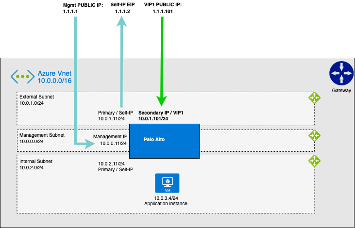

# LAB 1 Deploying the Palo Alto VE in Azure

### Deploying via the Azure Deploy button

[](https://portal.azure.com/#create/Microsoft.Template/uri/https%3A%2F%2Fraw.githubusercontent.com%2Foncledave01%2Ff5-azure-arm-templates-v2%2Fmain%2Fexamples%2Fexam%2Fazuredeploy.json)

## Contents

  - [Deploying via the Azure Deploy button](#deploying-via-the-azure-deploy-button)
  - [Diagram](#diagram)
  - [Accessing the Palo Alto](#accessing-the-Palo Alto)
    - [SSH](#ssh)
    - [WebUI](#webui)
  - [Deleting this Solution](#deleting-this-solution)
    - [Deleting the deployment via Azure Portal](#deleting-the-deployment-via-azure-portal)
    - [Deleting the deployment using the Azure CLI](#deleting-the-deployment-using-the-azure-cli)


## Diagram



### Accessing the Palo Alto

From Parent Template Outputs:
  - **Console**:  Navigate to **Resource Groups > *RESOURCE_GROUP* > Deployments > *DEPLOYMENT_NAME* > Outputs**.
  - **Azure CLI**: 
    ```bash
    az deployment group show --resource-group ${RESOURCE_GROUP} --name ${DEPLOYMENT_NAME}  -o tsv --query properties.outputs" 
    ```

- Obtain the vmId of the Palo Alto Virtual Machine *(will be used for password later)*:
  - **Console**: Navigate to **Resource Groups > *RESOURCE_GROUP* > Deployments > *DEPLOYMENT_NAME* > Outputs > PaloAltoVmId**.
  - **Azure CLI**: 
    ```bash
    az deployment group show --resource-group ${RESOURCE_GROUP} --name ${DEPLOYMENT_NAME}  -o tsv --query properties.outputs.PaloAltoVmId.value
    ```

- Obtain the public IP address of the Palo Alto Management Port:
  - **Console**: Navigate to **Resource Groups > *RESOURCE_GROUP* > Deployments > *DEPLOYMENT_NAME* > Outputs > *PaloAltoManagementPublicIp***.
  - **Azure CLI**: 
    ``` bash 
    az deployment group show --resource-group ${RESOURCE_GROUP} --name ${DEPLOYMENT_NAME} -o tsv --query properties.outputs.PaloAltoManagementPublicIp.value
    ```

- Or if you are going through a bastion host (when **provisionPublicIP** = **false**):
  - Obtain the public IP address of the bastion host:
    - **Console**: Navigate to **Resource Groups > *RESOURCE_GROUP* > Overview > *uniqueId*-bastion-vm > Public IP address**.


  - Obtain the private IP address of the Palo Alto Management Port:
    - **Console**: Navigate to **Resource Groups > *RESOURCE_GROUP* > Deployments > *DEPLOYMENT_NAME* > Outputs > *PaloAltoManagementPrivateIp***.
    - **Azure CLI**: 
      ``` bash 
      az deployment group show --resource-group ${RESOURCE_GROUP} --name ${DEPLOYMENT_NAME} -o tsv --query properties.outputs.PaloAltoManagementPrivateIp.value
      ```


#### SSH
  
  - **SSH key authentication**: 
      ```bash
      ssh admin@${IP_ADDRESS_FROM_OUTPUT} -i ${YOUR_PRIVATE_SSH_KEY}
      ```
  - **Password authentication**: 
      ```bash 
      ssh quickstart@${IP_ADDRESS_FROM_OUTPUT}
      ``` 
      at prompt, enter your **PaloAltoVmId** (see above to obtain from template "Outputs")


    - OR if you are going through a bastion host (when **provisionPublicIP** = **false**):

        From your desktop client/shell, create an SSH tunnel:
        ```bash
        ssh -i [your-private-ssh-key.pem] -o ProxyCommand='ssh -i [your-private-ssh-key.pem] -W %h:%p [AZURE-USER]@[BASTION-HOST-PUBLIC-IP]' [Palo Alto-USER]@[Palo Alto-MGMT-PRIVATE-IP]
        ```

        Replace the variables in brackets before submitting the command.

        For example:
        ```bash
        ssh -i ~/.ssh/mykey.pem -o ProxyCommand='ssh -i ~/.ssh/mykey.pem -W %h:%p azureuser@34.82.102.190' admin@10.0.0.11
        ```

#### WebUI

1. Obtain the URL address of the Palo Alto Management Port:
  - **Console**: Navigate to **Resource Groups > *RESOURCE_GROUP* > Deployments > *DEPLOYMENT_NAME* > Outputs > PaloAltoMgmtPublicUrl**.
  - **Azure CLI**: 
    ```bash
    az deployment group show --resource-group ${RESOURCE_GROUP} --name ${DEPLOYMENT_NAME}  -o tsv --query properties.outputs.PaloAltoManagementPublicUrl.value
    ```

  - OR when you are going through a bastion host (when **provisionPublicIP** = **false**):
    - From your desktop client/shell, create an SSH tunnel:

        ```bash
        ssh -i [your-private-ssh-key.pem] [AZURE-USER]@[BASTION-HOST-PUBLIC-IP] -L 8443:[Palo Alto-MGMT-PRIVATE-IP]:[PaloAlto-GUI-PORT]
        ```
        For example:
        ```bash
        ssh -i ~/.ssh/mykey.pem azureuser@34.82.102.190 -L 8443:10.0.0.11:443
        ```

        NOTE: `[PaloAlto-GUI-PORT]` is 443 for multi-NIC deployments and 8443 for single-NIC deployments.

        You should now be able to open a browser to the Palo Alto UI from your desktop:

        https://localhost:8443


2. Open a browser to the Management URL.
  - *NOTE: By default, the Palo Alto system's WebUI starts with a self-signed cert. Follow your browser's instructions for accepting self-signed certs (for example, if using Chrome, click inside the page and type this "thisisunsafe". If using Firefox, click "Advanced" button, click "Accept Risk and Continue").*
  - To Login: 
    - username: quickstart
    - password: **PaloAltoVmId** (see above to obtain from template "Outputs")


## Deleting this Solution

### Deleting the deployment via Azure Portal 

1. Navigate to **Home** > Select "Resource Groups" Icon.

2. Select your Resource Group by clicking the link.

3. Click **Delete Resource Group**.

4. Type the name of the Resource Group when prompted to confirm.

5. Click **Delete**.

### Deleting the deployment using the Azure CLI

```bash
az group delete -n ${RESOURCE_GROUP}
```
